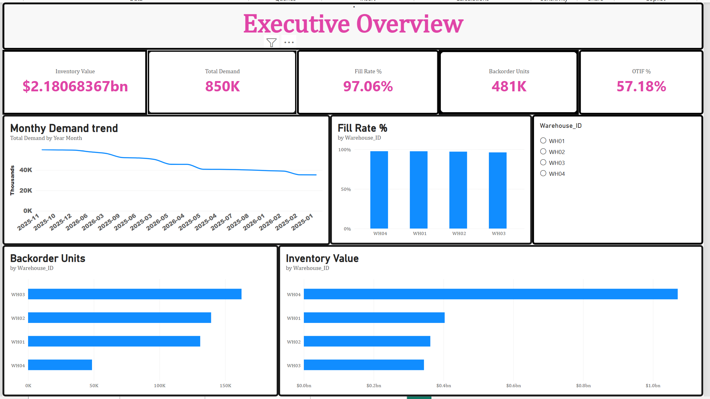
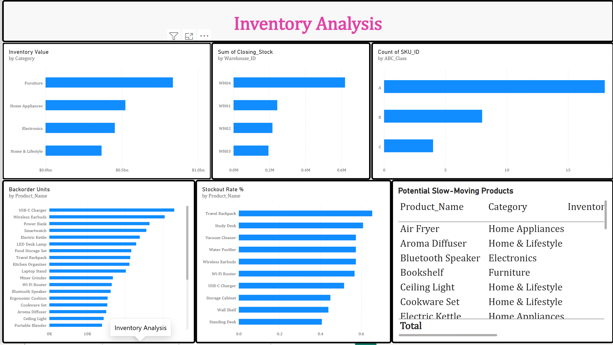
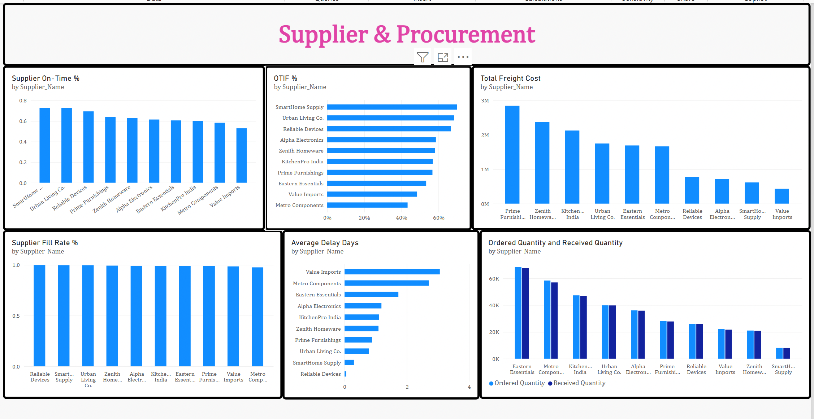
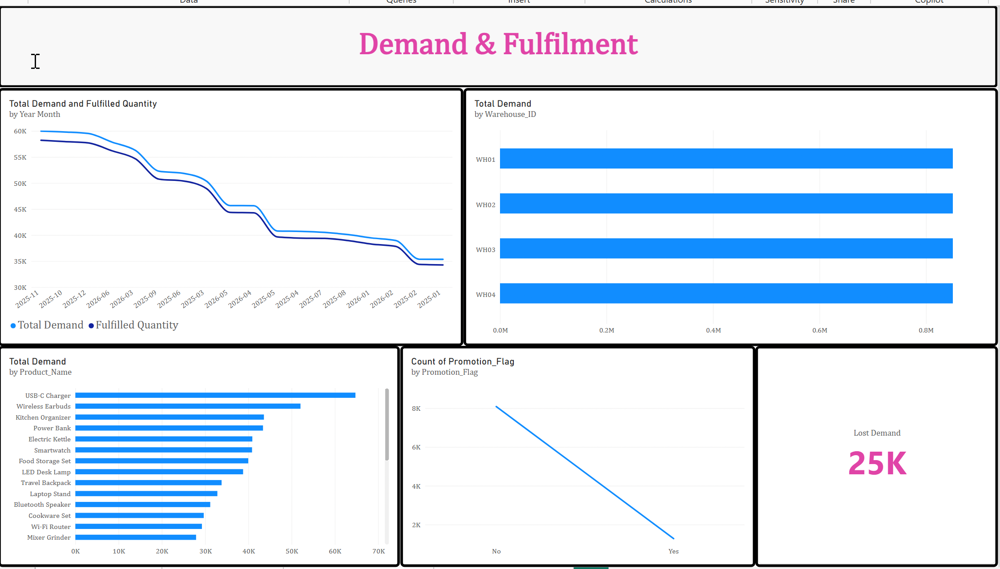

# NovaCart Supply Chain & Inventory Analytics

## Project Overview

NovaCart is a fictional retail company facing inventory and supply-chain challenges including stockouts, excess inventory, supplier delays and demand fulfilment issues.

This project analyses inventory health, warehouse performance, supplier reliability and customer demand using Excel, SQL, Python and Power BI.

---

## Tools Used

- Excel
- MySQL
- Python
- Pandas
- Matplotlib
- Power BI
- DAX

---

## Dataset

The analysis uses six datasets:

- Inventory Snapshots
- Purchase Orders
- Sales Demand
- Product Master
- Supplier Master
- Warehouse Master

---

## Project Workflow

Excel  
↓  
SQL  
↓  
Python EDA  
↓  
Power BI Dashboard  
↓  
Business Insights & Recommendations

---

## Excel Analysis

Excel was used for:

- Data-quality validation
- Duplicate checks
- Missing-value checks
- Invalid and negative-value checks
- Inventory value calculation
- Quick PivotTable exploration

---

## SQL Analysis

SQL was used to analyse:

- Inventory value
- Inventory value by warehouse
- Backorders by warehouse
- Products with highest backorders
- Warehouse fill rate
- Estimated lost sales
- Supplier delivery delay
- Supplier on-time %
- Supplier fill rate
- OTIF %
- Product demand
- Promotion vs non-promotion demand
- Monthly demand growth
- Supplier and warehouse rankings
- Stockout trends

[View SQL Analysis](SQL_KPI.sql)

---

## Python EDA

Python was used for:

- Warehouse performance analysis
- Stockout-risk analysis
- Supplier delay analysis
- Monthly demand trend
- Demand growth analysis
- ABC inventory classification

[View Python Notebook](NovaCart_SuppyChain.ipynb)

---

## Power BI Dashboard

The Power BI report contains four pages:

- Executive Overview
- Inventory Analysis
- Supplier & Procurement
- Demand & Fulfilment

### Executive Overview

### Inventory Analysis

### Supplier & Procurement

### Demand & Fulfilment

 NovaCartInsights_Image.png

---

## Key KPIs

- Inventory Value
- Total Demand
- Fill Rate %
- Backorder Units
- OTIF %
- Supplier On-Time %
- Supplier Fill Rate %
- Average Delay Days
- Lost Demand

---

## Project Files

- [Excel Analysis](novacart_supply_chain_inventory_analytics_ExcelWork.xlsx)
- [SQL Analysis](SQL_KPI.sql)
- [Python EDA](NovaCart_SuppyChain.ipynb)
- [Power BI Dashboard](NvaCart_PowerBI.pbix)
-

---

## Key Insights

- Add your actual warehouse finding here.
- Add your highest-backorder product here.
- Add your supplier OTIF finding here.
- Add your promotion-demand finding here.
- Add your ABC inventory finding here.

---

## Recommendations

- Inventory redistribution
- Safety-stock optimisation
- Reorder-point adjustment
- Supplier performance review
- Promotion planning
- Slow-moving inventory reduction

---

## Author

Shivani Mittal
